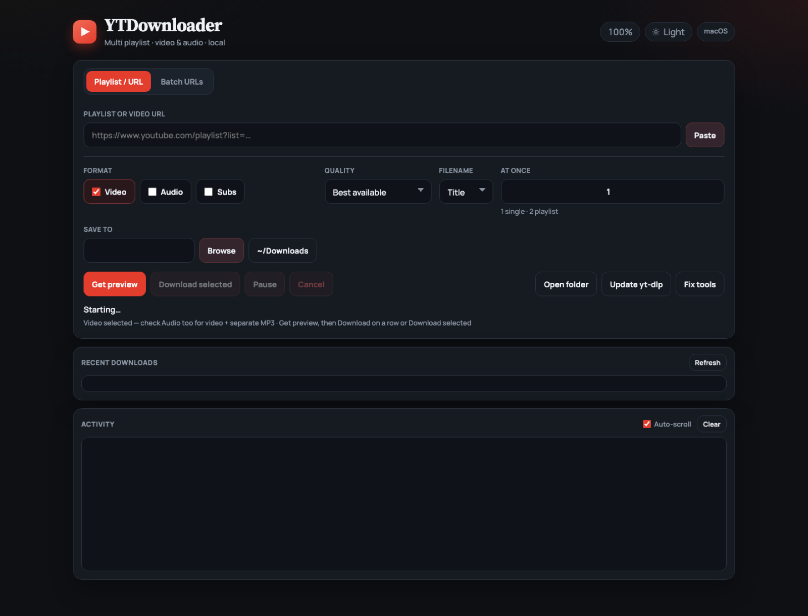
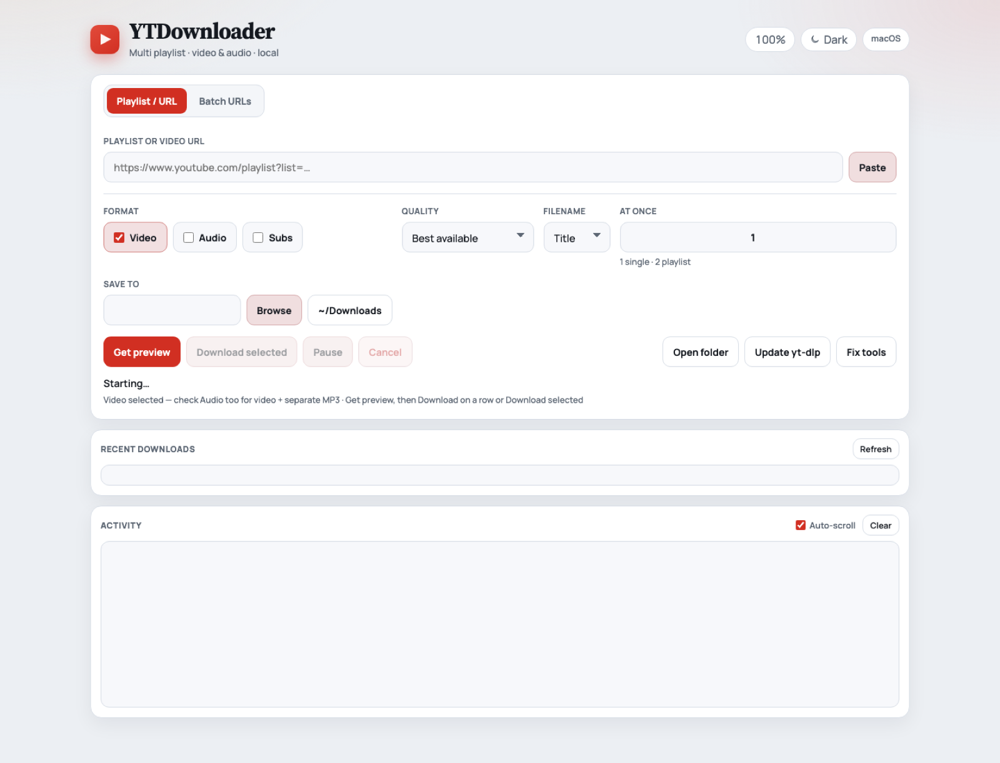
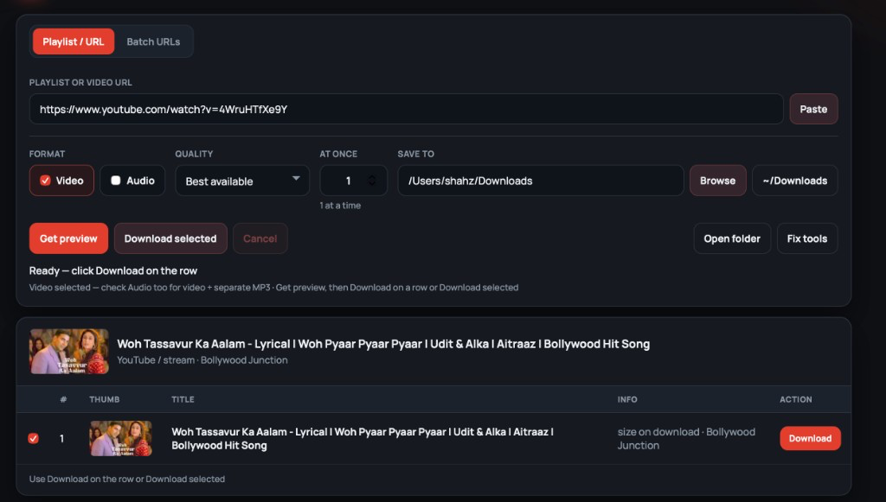
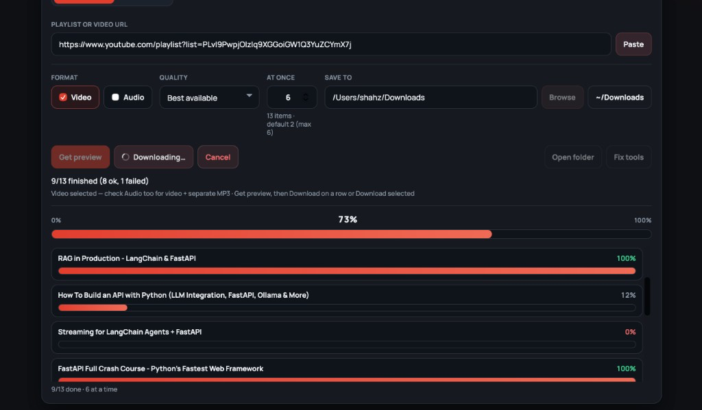

# YTDownloader

[](https://github.com/Shahzaibzah00r/YouTube-Downloader/actions/workflows/ci.yml)
[](https://github.com/Shahzaibzah00r/YouTube-Downloader/actions/workflows/release.yml)
[](https://github.com/Shahzaibzah00r/YouTube-Downloader/releases/latest)

Free macOS YouTube / playlist downloader for **Intel** and **Apple Silicon**.  
Runs in a **native Mac window** (not a browser tab) with dark & light themes.

**Repo:** https://github.com/Shahzaibzah00r/YouTube-Downloader

<p align="center">
  
</p>

<p align="center">
  
</p>

---

## Screenshots

| Preview before download | Live progress, speed & ETA |
|-------------------------|----------------------------|
|  |  |

---

## Free download (DMG)

1. Open the latest **[Release](https://github.com/Shahzaibzah00r/YouTube-Downloader/releases/latest)**
2. Pick the DMG for your Mac:

| Your Mac | File |
|----------|------|
| **Intel** | `YTDownloader-…-Intel-macOS.dmg` |
| **Apple Silicon** (M1 / M2 / M3 / M4) | `YTDownloader-…-AppleSilicon-macOS.dmg` |

Apple menu → **About This Mac** if you’re unsure.

3. Drag **YTDownloader** into **Applications** and open it  
4. If `yt-dlp` / `ffmpeg` are missing, click **Fix tools** ([Homebrew](https://brew.sh) required)

### macOS “blocked” / Gatekeeper (no paid Apple account)

We don’t use a paid Apple Developer ID, so macOS may warn on first open. YTDownloader **automatically**:

- clears the quarantine flag (`xattr -cr`) on launch and after in-app updates  
- ad-hoc code-signs the app (no certificate purchase)

That removes the usual Settings → Privacy loop for most users. If a download is still blocked once:

```bash
xattr -cr /Applications/YTDownloader.app
open /Applications/YTDownloader.app
```

Or right-click the app → **Open** → **Open**. Full Apple notarization is the only way to silence Gatekeeper completely — that requires a paid developer account.

### App updates

- On open, YTDownloader checks GitHub Releases once per day  
- **Check update** asks to install when a newer version exists  
- **Install update** downloads the right DMG, replaces the app, clears quarantine, and relaunches  

---

## Run from source

```bash
git clone https://github.com/Shahzaibzah00r/YouTube-Downloader.git
cd YouTube-Downloader
./setup.sh                 # once: venv, tools, native window support
./Open\ YTDownloader.command
```

Or:

```bash
.venv/bin/python yt_downloader.py
```

Also: `./install.sh`

---

## Features

- Native Mac window (pywebview) — dark / light theme, zoom (⌘− ⌘+ ⌘0)
- Playlist / single URL **or** batch URLs (one per line)
- Preview with thumbnails before download — select rows IDM-style
- **Video**, **Audio (MP3)**, or both · optional **Subtitles** (`.srt`)
- Quality: best / 1080p / 720p / 480p
- Concurrent downloads (up to 6) with per-item + overall progress
- Speed, ETA, pause / resume, cancel, retry failed
- Filename templates (title · uploader − title · date − title)
- Recent downloads history + **Reveal in Finder**
- Drag-and-drop URLs · paste from clipboard · playlist filter
- macOS notification when a batch finishes
- **Check update** (GitHub Releases) + **Update yt-dlp** + **Fix tools**
- Auto clear Gatekeeper quarantine on launch / install (unsigned OSS-friendly)
- Direct HTTP file URLs as well as YouTube

---

## Quick usage

1. Paste a playlist or video URL (or drop links onto the window)  
2. Click **Get preview**  
3. Pick format / quality / save folder  
4. **Download** on a row, or select several → **Download selected**  
5. Use **Pause** / **Resume** or **Retry failed** as needed  

**Shortcuts**

| Action | Shortcut |
|--------|----------|
| Zoom out / in / reset | ⌘− / ⌘+ / ⌘0 |
| Paste into URL field | Paste button or ⌘V |

---

## CLI

```bash
./download.sh "https://www.youtube.com/watch?v=VIDEO_ID"
./download.sh "https://www.youtube.com/watch?v=VIDEO_ID" ~/Desktop 720
```

Quality options: `best` · `1080` · `720` · `480` · `audio`

---

## CI / CD

| Event | Result |
|-------|--------|
| Push / PR | Lint + smoke-build DMG |
| Tag `v*` | Build Intel + Apple Silicon DMGs → GitHub Release |

```bash
git tag v1.7.0
git push origin v1.7.0
```

See [docs/CI_CD.md](./docs/CI_CD.md) and [PUBLISH.md](./PUBLISH.md).

---

## Credits

Created and maintained by **Shahzaib** ([@Shahzaibzah00r](https://github.com/Shahzaibzah00r)).  
See [CREDITS.md](./CREDITS.md).

## License

MIT — see [LICENSE](./LICENSE).
